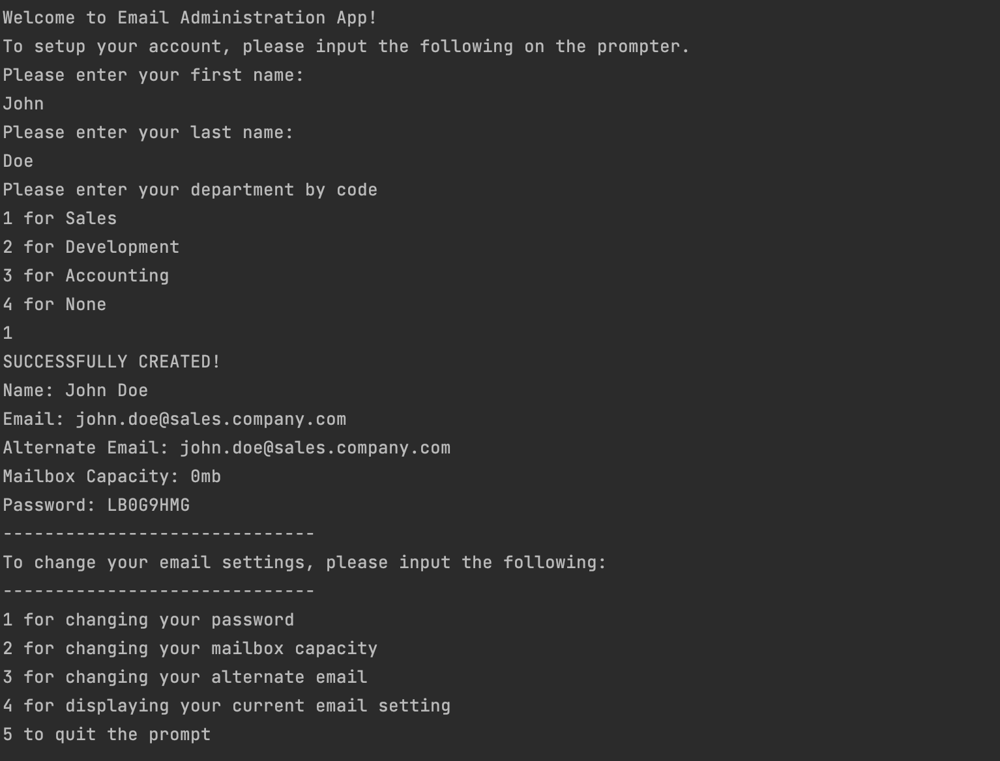

# Java Project: Email Administration Application

## Scenario:
You are an IT support administrator. You are charged with the task of creating email accounts for new hires.

## Requirements:
- Generate an email with the following syntax: *firstname.lastname@department.company.com*
- Determine the departments (sales, development, accounting), if none leave blank.
- Generate random string for password
- Have set methods for changing password, mailbox capacity, alternate email address
- Have get methods for displaying name, email, and mailbox capacity.


## Tools Used

- Java SE 17 (LTS)
- Maven
- Intellij IDEA for IDE
- Scanner class
- SecureRandom class

## Screenshots

Sample screenshot of the application running in terminal




## Run Locally

Clone the project

```bash
  git clone https://github.com/donchriscorleone/email-administration-app-java.git
```

Go to the project directory

```bash
  cd email-administration-app
```

Build the project

```bash
  ./mvnw clean package
```

Start the project
```cmd
  java -jar target/*.jar
```


## Authors

- [@donchriscorleone](https://www.github.com/donchriscorleone)


## 🔗 Links
[](https://www.linkedin.com/in/christopher-ii-lajom-031959211/)

[](https://www.instagram.com/devchristopherii)

[](https://www.twitter.com/topheriidev)
